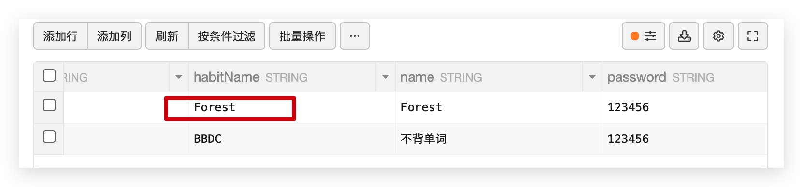
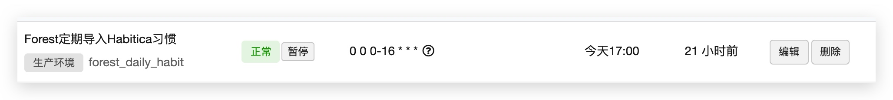

# Forest 配置说明

## 环境变量

> `云引擎` ->  `设置` 处的环境变量。

* **FOREST_SECRET** `必填` : Forest App 中的 cookie(remember_token) ([**具体内容**](get-forest-cookie.md))
* **FOREST_AREA** `必填` : Forest App 所在的服务器。(`china` / `global`)

## Habit

> `数据存储` -> `结构化数据` -> `Projects` 中的习惯设置。

找到 `name` 为 Forest 的一行，将 `habitName` 设置成你想要将 Forest 与 Habitica 绑定的习惯名字。

**需要在 Habitica 上先创建习惯，如果不存在则程序无法正确运行。**

## 云函数

> 你可以在 `云引擎` -> `定时任务` 处设置云函数让程序定期检测 不背单词 并自动导入 Habitica 。

* **forest_daily_habit** : 自动检测不背单词并导入 Habitica 。

名称可以任意设置，例如 : `不背单词定期导入Habitica习惯`

由于 LeanCloud 的时区是 US ，因此推荐设置 Cron 表达式为 `0 0 0-16 * * *` (从 8:00 - 24:00 每隔一小时检测一次)

