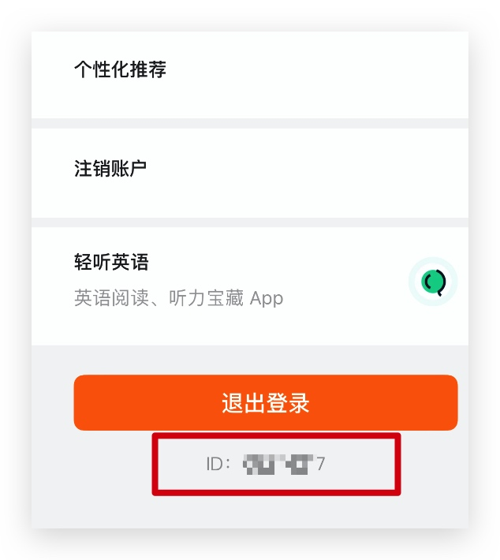
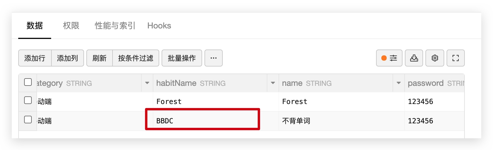
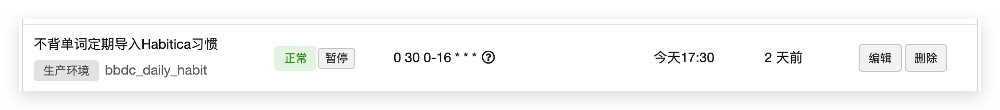

# 不背单词配置说明

## 环境变量

> `云引擎` ->  `设置` 处的环境变量。设置完成后请重启应用。

* **BBDC_USERID** `必填` : 你的不背单词的用户ID。可在不背单词APP中的 `设置` 最底部看到。
* **BBDC_STEP** `选填` : 每背完多少单词触发一次 Habitica 习惯。默认为 **20** 。

## Habit

> `数据存储` -> `结构化数据` -> `Projects` 中的习惯设置。

找到 `name` 为不背单词的一行，将 `habitName` 设置成你想要将 不背单词 与 Habitica 绑定的习惯名字。

**需要在 Habitica 上先创建习惯，如果不存在则程序无法正确运行。**

## 云函数

> 你可以在 `云引擎` -> `定时任务` 处设置云函数让程序定期检测 不背单词 并自动导入 Habitica 。

* **bbdc_daily_habit** : 自动检测不背单词并导入 Habitica 。

名称可以任意设置，例如 : `不背单词定期导入Habitica习惯`

由于 LeanCloud 的时区是 US ，因此推荐设置 Cron 表达式为 `0 30 0-16 * * *` (从 8:30 - 24:30 每隔一小时检测一次)

